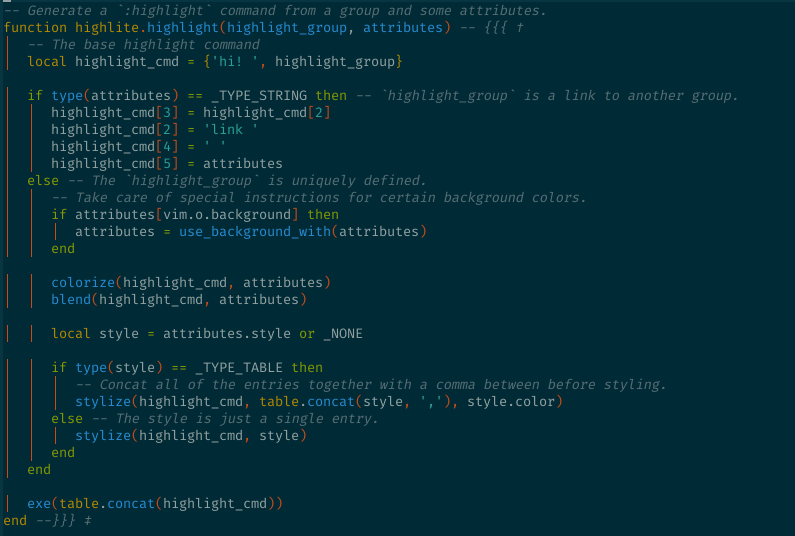

# Introduction

`nvim-soluarized` is a colorscheme based on [`vim-solarized8`](https://github.com/lifepillar/vim-solarized8) and written with [`nvim-highlite`](https://github.com/Iron-E/nvim-highlite). It supports both light _and_ dark backgrounds. See __usage__ for more.

## Preview



## Prerequisites

1. Neovim 0.7+

## Installation

1. Install a plugin manager such as [`packer.nvim`](https://github.com/wbthomason/packer.nvim) and use it to "plug" this repository.
	```lua
	use 'Iron-E/nvim-soluarized'
	```
2. Specify this colorscheme as your default colorscheme in the `init.vim`:
	```vim
	" Enable 24-bit color output. Only do this IF your environment supports it.
	" This plugin is fully compatible with 8-bit, 16-bit, and 24-bit colors.
	set termguicolors

	set bg=dark " or 'light'
	colorscheme soluarized
	```
	Or in `init.lua`:
	```lua
	vim.opt.termguicolors = true
	vim.opt.bg = 'dark' -- or 'light'
	vim.api.nvim_command 'colorscheme soluarized'
	```

### Creating Your Own

1. Fork this repository, or clone it with `git clone https://github.com/Iron-E/nvim-soluarized`.
2. Follow the instructions in [`colors/soluarized.vim`](colors/soluarized.vim).
	* If you are on a Unix system, use the [setup script](setup.sh) like so:
	```sh
	chmod +x ./setup.sh
	./setup.sh soluarized <colorscheme>
	```
	Where `<colorscheme>` is the name of your desired colorscheme.
	* If you are on Windows, rename the files manually.

See the [main repo](https://github.com/Iron-E/nvim-highlite) for more usage tips.
